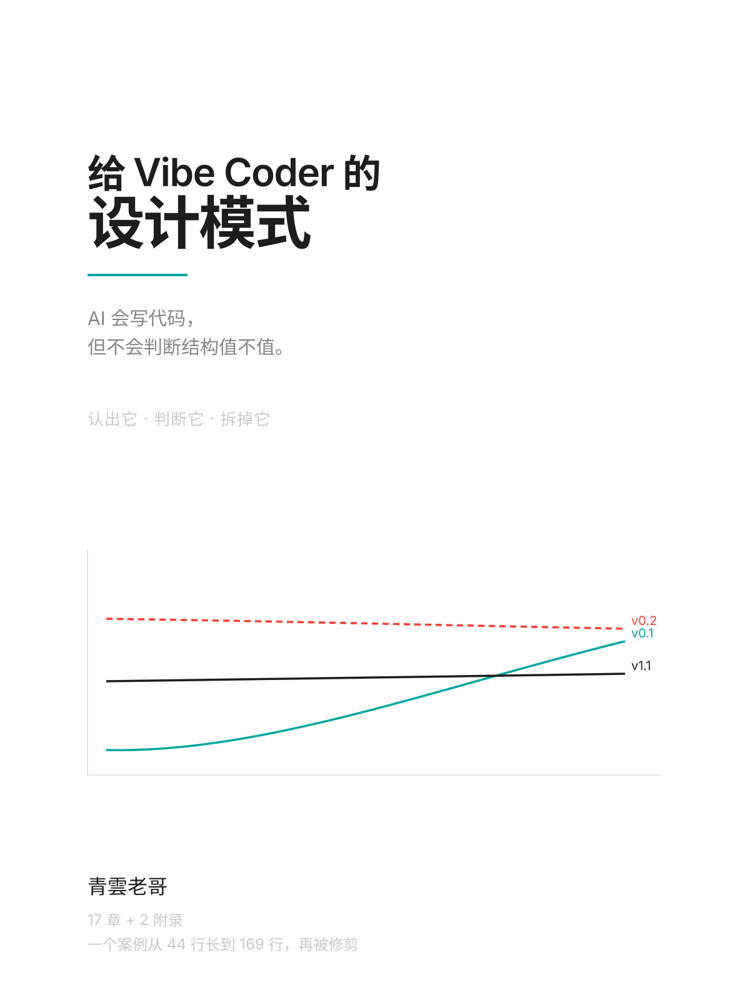

# 给 Vibe Coder 的设计模式

AI 会写代码，但不会判断结构值不值。

这本书不教你怎么写设计模式——那种书已经够多了，而且 AI 写得比人快。它教的是另外三件事：**在 AI 生成的代码里认出模式、判断这个抽象赚不赚、必要时把它拆掉。**

## 它回答的问题

你用 AI 写了一个功能，跑起来了，测试也过了。但你打开文件列表，看到六个文件：一个接口、三个实现、一个工厂、一个 service。

- 这些抽象是必要的，还是模型的习惯？
- 我以后要加的功能，会用到它们吗？
- 如果我想简化，从哪一层开始拆？

这三个问题，现有的设计模式书都答不了——它们假定你的任务是「写」。

## 怎么读

**完整读一遍**：`dist/book.html`（浏览器打开，图正常渲染）或 `dist/book.md`，三小时左右。

**按章读**：目录在 [CHAPTERS.md](CHAPTERS.md)。核心是第 04–13 章，其余是外壳。

**只想拿结论**：附录 B 是一页检查清单，可以打印出来贴在显示器上。

**想自己验一遍**：`case/` 下有五个版本的代码，从 44 行到 162 行，每个版本对应一章。跑起来：

```bash
cd case && npm install && npm run dev
```

## 读者是谁

用过 AI 写过东西、但没系统学过计算机的人。你能读懂代码，也能改，但不确定 AI 给的结构对不对。

不需要你会 UML，不需要你写过类继承，也不假定你离开 AI 还能从零写出一个模块。

## 这本书的组织方式

不按 GoF 的 23 个模式分章，按**你会遇到的判断场景**分。一个场景里可能同时出现两三个模式——真实代码就是这样的。

每一章回答一个具体问题，比如「这个接口只有一个实现，正常吗」「包了一层又一层，哪层是多余的」。

模式名会在需要的时候出现，附录 A 有索引，方便按名字反查。

## 贯穿全书的案例

一本速记应用。它从「打开就能写」的 44 行开始，被 AI 重构到 149 行七个文件，最后被修剪到 162 行六个文件——**但终点能撑的功能比起点多得多**。

读者能看着抽象从无到有、从有到滥、最后被放到该放的地方。这是按模式分类的书做不到的，它们的例子永远停在「设计得刚刚好」的那一刻。

## 状态

**初稿完成。** 17 章 + 2 个附录，约 3.96 万字。

```
manuscripts/   各章 markdown
figures/       封面 + 7 张插图（手写 SVG）
case/          贯穿案例，v0.1 → v1.1
design/        视觉基准 + 插图的两条踩坑记录
notes/         早期探索留下的发现
scripts/       插图生成、拼书、HTML 构建
dist/          book.md / book.html
```

下一步：逐章校对、补图表、决定发布形式。

## 重新生成

```bash
node scripts/figures.mjs      # 7 张插图
node scripts/cover.mjs        # 封面
node scripts/build-book.mjs   # dist/book.md
node scripts/build-html.mjs   # dist/book.html
```

`figures.mjs` 里所有尺寸都由布局推导，不手填。改完插图记得验一遍 XML 合法性：

```bash
python3 -c "import xml.dom.minidom,sys;[xml.dom.minidom.parse(f) for f in sys.argv[1:]]" figures/*.svg
```
