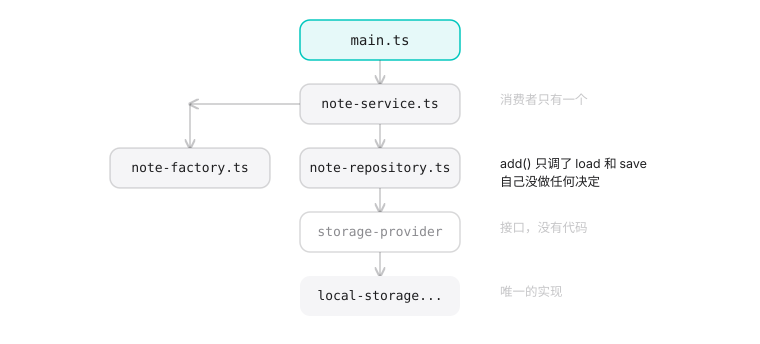
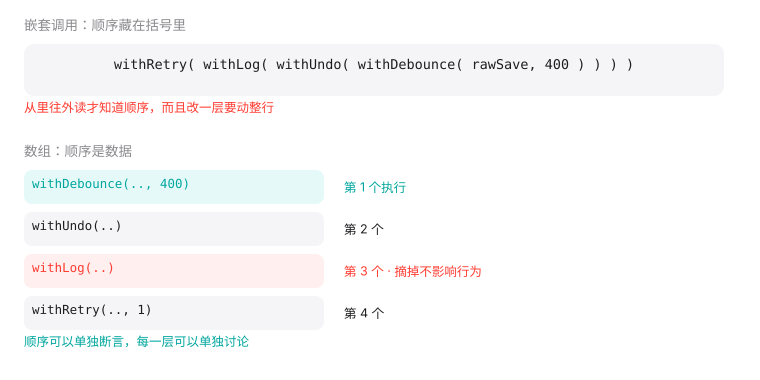
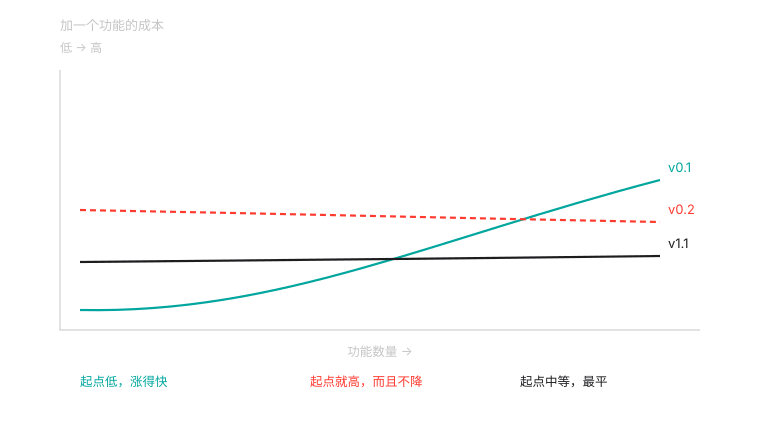

# 为什么还要讲设计模式

## 先看一段代码

我让 AI 写一个速记应用。要求很简单：打开就能写，写完自己存下来。

第一版出来了，一个文件，44 行。输入框、列表、localStorage，没有别的。

然后我说了一句几乎所有 vibe coder 都会说的话：

> 帮我重构一下，结构专业一点，以后好扩展。

它给了我七个文件。

```text
src/types.ts                            笔记的类型定义
src/storage/storage-provider.ts         存储接口
src/storage/local-storage-provider.ts   存储实现
src/domain/note-factory.ts              创建笔记
src/domain/note-repository.ts           读写笔记
src/domain/note-service.ts              用例编排
src/main.ts                             界面
```

149 行，分了三层：存储、领域、界面。每个文件都写了 JSDoc，构造函数里注入依赖，还有自己的错误类型。

能跑，测试也过。

## 这里面有几个设计模式？

三个，如果你愿意数得更细，四个。

`StorageProvider` 是策略模式：把存储方式抽象成一个接口，将来换 IndexedDB 或者云端同步时上层不用改。`NoteFactory` 是工厂模式。`NoteRepository` 是仓储模式。`NoteService` 协调前后两者，算一层应用服务。

数对了。但数对不是重点。

## 哪些是必要的？

我们一个一个问。

`StorageProvider` 有几个实现？ 一个。

接口的意义在于有多个实现可以互换。现在只有一个，那这个接口唯一的作用是让 `LocalStorageProvider` 多写一行 `implements`，再让 `NoteRepository` 的构造函数多一个类型标注。

什么时候会有第二个？换 IndexedDB 的时候。那是什么时候？如果你答不出来，那就是现在不需要。

`NoteFactory` 在做什么？

```ts
create(draft: NoteDraft): Note {
  return {
    id: crypto.randomUUID(),
    text: draft.text,
    createdAt: draft.createdAt,
  }
}
```

造一个三个字段的对象。它没有逻辑，没有分支，没有需要隔离的变化点。把它换成一个函数，或者干脆内联到调用处，代码更短也更好读。

`NoteRepository.add` 在做什么？

```ts
add(note: Note): void {
  this.storage.save([note, ...this.storage.load()])
}
```

把一条笔记放到列表最前面，然后存回去。这是一行代码包了个方法名。

`NoteService.create` 呢？

```ts
create(draft: NoteDraft): Note {
  const note = this.factory.create(draft)
  this.repository.add(note)
  return note
}
```

两行。它把「创建」和「保存」串起来，而这两件事本来就该在一起做。

---

四个抽象，逐个问下来，没有一个此时此刻在赚钱。

这里有个检查句，你可以直接拿去用：

> **看到一个只有一个实现的接口，问一句：第二个什么时候来？**
>
> 答不出来，那就是还不该有。

## 但真正的问题不是这个

上面这些还可以争论。有人会说："现在只有一个实现，但三个月后一定会有第二个，提前抽象省事。"

这种争论没有结果，因为它比的是两种想象。

我更在意的是另一件事。我把 v0.1 和 v0.2 逐行比了一遍，发现重构弄丢了一个东西。

v0.1 里有个函数：

```ts
function escapeHtml(s: string): string {
  return s.replace(/[&<>]/g, (c) => ({ '&': '&amp;', '<': '&lt;', '>': '&gt;' })[c]!)
}
```

渲染笔记时用它转义。你在速记里写 `<script>`，它老老实实显示成文字，不会被执行。

**v0.2 里没有这个函数。**

149 行、七个文件、三层架构，比 44 行的那版更不安全。

这不是我故意设计的对照。写 v0.2 的时候，我的注意力全在分层上，那个函数就漏掉了。AI 重构真实会发生的就是这件事：**你要求"结构更专业"，得到的是层数，丢的是细节。**

所以判断一次重构好不好，不能只看它加了多少抽象，还要看它有没有弄丢什么。

## 为什么 AI 会长成这样

这不是模型笨。

设计模式这套东西是在 Java 和 C++ 的年代被总结出来的。那些语言里没有一等函数，想把你的一段行为传给另一个函数，唯一的办法是把它包成一个对象。所以「策略模式」在那些语言里不是设计技巧，是唯一可行的做法。

教材、博客、开源项目、面试题，三十年积累的语料全是那个形状。模型从这里面学，出来的自然是那个形状。

换到 TypeScript，情况变了。函数是一等公民，模块天生就是单例，对象可以随时加方法。教材里需要四个类才能表达的东西，现在一个函数参数就够了。

**同一个职责分配，两种长相。**

模型的训练数据里，前一种长相多出几个数量级。所以它给你 Java 时代的形状，这不是它的错，是分布的错。

## 这本书教什么

三个动作。

认出它。 这段代码里到底发生了什么？去掉语言形式之后，谁依赖谁，谁负责什么。

判断它。 这个抽象在赚钱还是在赔钱？判断标准不是"它是不是一个设计模式"，是"它服务几个消费者，省下多少改动"。

拆掉它。 如果你判断它不值，怎么安全地拆。什么时候不该拆，拆坏了怎么办。

这本书不替代 GoF。它假定你能写代码，只是不确定 AI 给的结构对不对。

## 同一个模式，三种长相

拿策略模式举例。

在 Java 里：

```java
interface ExportStrategy { String export(Data d); }
class CsvStrategy implements ExportStrategy { ... }
class JsonStrategy implements ExportStrategy { ... }
class Exporter {
  private ExportStrategy strategy;
  String run(Data d) { return strategy.export(d); }
}
```

在 TypeScript 里，同一个职责分配：

```ts
function exportData(data: Data, format: (d: Data) => string): string {
  return format(data)
}
```

在 Python 里：

```python
def export_data(data, format):
    return format(data)
```

三个版本说的是同一件事：把「怎么导出」这个决定交出去，让调用方传进来。

Java 那版之所以长，是因为语言不支持把函数直接传过去，只能先包成对象。

这个透视镜后面每一章都会用到。看到一坨类的时候，先问一句：如果这门语言支持更简单的写法，它会长什么样？

## 最后

读完这本书，你应该能接手一份 AI 生成的代码，说出承重的是哪几处、多余的是哪几处，并且知道从哪开始拆。

它不教你怎么设计大型系统。那是另一本书，而且那件事 AI 目前也帮不上什么忙。

---

案例的完整代码在 `case/`。`v0.1` 是那 44 行，`v0.2` 是那 149 行，你可以自己逐行比一遍，看看还丢了什么我没提到的。

---

# 拿到一份 AI 生成的代码，先看什么

## 别从代码开始读

你让 AI 写完一个功能，它给了你一堆文件。下一步该干什么？

多数人的第一反应是打开最熟悉的那个文件，或者按字母顺序从第一个读起。这两个都不好使，因为你还不知道哪些文件重要。

有一个东西比代码更早暴露真相：**文件列表。**

```bash
$ find src -type f -name '*.ts' | sort
src/types.ts
src/storage/local-storage-provider.ts
src/storage/storage-provider.ts
src/domain/note-factory.ts
src/domain/note-repository.ts
src/domain/note-service.ts
src/main.ts
```

先别打开任何一个。看这个列表能读出不少东西。

## 文件列表先说了一件事

它分了层。 `storage/` 和 `domain/` 两个目录，说明作者脑子里有一个分层的模型：存储归存储，业务归业务，中间还有一层仓储。

它有一个 `types.ts`。 通常意味着类型被集中管理，不在各文件里就近声明。

它有一个 `note-factory.ts`。 这是最有信息量的一行——一个专门的工厂文件，说明作者认为「创建笔记」是一件独立的事，值得一个文件。

这三件事都是**作者的意图**，不是代码的性质。你可能同意，可能不同意，但现在你知道了他在想什么。

还有一件事可以直接数：七个文件，这个功能有几个操作？ 速记应用到这一步只有两个操作：列出笔记、创建笔记。两个操作、七个文件，比例不太对。这不构成罪证，但值得记下来。

## 从入口走一条最短路径

看完列表，打开入口——通常是 `main.ts` 或者 `index.ts`，也就是程序真正开始跑的地方。

然后挑一件事，跟着它走到底。只跟一件事，比如「我敲了一行字，它是怎么存下来的」。

在 `v0.2` 里，这条路是这样的：

```text
main.ts          input 事件触发，400ms 后调 service.create()
  ↓
note-service.ts  create() 调 factory.create() 拿到 note
  ↓              create() 再调 repository.add(note)
note-repository.ts  add() 调 storage.load() 取出现有笔记
  ↓              把新笔记放最前，调 storage.save()
local-storage-provider.ts  save() 写 localStorage
```

五个文件。

现在换一条路走。在 `v0.1` 里同一件事：

```text
main.ts           input 事件触发，400ms 后往数组前面塞一条
  ↓              调 localStorage.setItem()
（完）
```

一个文件。


两条路做的事完全一样。差别只在中间要经过几个文件。

## 数一下你跳了几次

这是全书会反复用的一个动作：**给定一个改动，数你要打开几个文件。**

「笔记存下来的时候记一下时间」——在 v0.1 里改一处，在 v0.2 里要改几处？

答案是四处：`types.ts` 加字段、`note-factory.ts` 填字段、`main.ts` 传值，通常还要动一下 `note-service.ts` 的签名。

四处，而且这四处分布在三层里。

这个数字比「149 行 vs 44 行」更能说明问题。行数可以假装看不见，跳转次数不行——**你每次都要真的打开那些文件。**

## 这一步的产出

读完这一轮，你应该能回答三个问题：

1. 这个功能有几个操作？
2. 有几层？每层叫什么？
3. 从一个操作的最外面到最里面，要经过几个文件？

不用评价好坏，先拿到这三个数字。

下一章说这三个数字怎么用。

---

# 抽象的三笔开销

## 抽象不是免费的

上一章量了三个数：操作数、层数、跳转次数。这一章说它们能换来什么，以及要付出什么。

先说结论：**抽象的开销不在代码行数上。**

`v0.1` 是 44 行，`v0.2` 是 149 行。行数差了 3.4 倍，但这个数字几乎不影响你。多出来的 105 行你不用背，也不用维护。

真正影响你的是另外三样。

## 第一笔：跳转

要理解一段逻辑，你得在文件之间移动。每一次移动都有成本——打开、定位、记住刚才看到的东西。

在 `v0.2` 里回答「笔记是怎么存的」，要跳五次。在 `v0.1` 里，跳零次。

跳转次数是可以数的，也是可以直接比较的。 这是三笔开销里最实在的一笔。

有个粗糙但好用的上限：如果一个功能的理解路径超过三跳，你每次改它之前都会先犹豫一下。犹豫本身就是成本。

## 第二笔：改动面

「加一个字段」在 v0.1 里改一处，在 v0.2 里改四处。

抽象在这里做了一笔交换：它把某些改动集中了，把另一些改动分散了。

- 换存储方式：v0.2 只改一个文件，v0.1 要改散落各处的 `localStorage` 调用
- 加一个笔记字段：v0.2 要穿过四层，v0.1 只改一处

**所以「抽象让改动更容易」这句话缺了主语。** 它让哪一类改动更容易？

判断方法很直接：列出你未来三个月最可能做的五个改动，每个数一遍要开几个文件。 如果抽象的收益都在你永远不会做的改动上，那它就是在收你的税。

## 第三笔：读代码时的默认假设

这笔最隐蔽。

`v0.1` 里，`localStorage.setItem()` 就写在那儿。你一眼看到它在存东西，也一眼看到它是同步的。

`v0.2` 里，你看到的是 `this.storage.save(notes)`，声明为返回 `void`。你必须去读实现，才知道它是同步的。

第 04 章那个换 IndexedDB 失败的故事，根子就在这儿：接口没告诉你任何实现细节，于是你以为换实现很容易——实际上接口悄悄固化了同步这个前提。

**抽象隐藏的东西不是不存在，只是搬到了你需要的时候才去找。**

## 三笔加起来

| | v0.1 | v0.2 |
|---|---|---|
| 理解「笔记怎么存的」要跳几次 | 0 | 5 |
| 加一个字段要改几个文件 | 1 | 4 |
| 换存储方式要改几个文件 | 多 | 1 |
| 隐藏的前提 | 无 | 同步 |

看最后一行。v0.1 在换存储这一项上输得很难看，但它没有任何隐藏前提。

这也是为什么第 00 章那个 44 行的版本不是「不专业」，而是它把复杂度放对了地方：两个操作的速记应用，不需要为「将来可能换存储」预付成本。

## 一笔不能忽略的账

还有第四笔，不属于抽象本身，但每次重构都要算：**重构的过程中弄丢了什么。**

`v0.2` 比 `v0.1` 少了 HTML 转义。这是从 44 行变成 149 行的过程中掉出去的，而且没有任何地方会提醒你。

所以每次接受一次重构，做一件事：**把新旧两版并排打开，不只看加了什么，也看少了什么。**

多出来的抽象是看得见的，丢掉的细节是看不见的。你只会注意到前者。

---

# 把一段陌生代码读成一张图

## 不画 UML

几乎所有讲设计模式的书都会给你看类图：空心三角表示继承，空心菱形表示聚合，实心菱形表示组合。

这一章不画那个。不是因为它错，是因为它需要你先接受一整套记号，才看得懂它想说什么。而你现在的问题是「这段代码在干什么」，不是「这段代码符合哪种关系」。

只画两种线：

- 实线箭头：谁调用谁
- 虚线：谁持有谁

就这么多。

## 拿速记应用画一张

从「保存一条笔记」这一件事出发，画出 `v0.2`：

```text
main.ts
  │
  │ 调 service.create()
  ▼
note-service.ts ──────┐
  │                   │ 持有
  │ 调 factory.create()│
  ▼                   ▼
note-factory.ts    note-repository.ts
                      │
                      │ 持有
                      ▼
                storage-provider.ts
                      ▲
                      │ 实现
                local-storage-provider.ts
```



九行，画完了。

这张图里有两种节点。`main.ts`、`note-service.ts`、`note-repository.ts`、`local-storage-provider.ts` 在调用链上；`note-factory.ts` 挂在旁边，是被持有的，只被调用一次。

## 找出「直通」的节点

现在做一件很简单的事：把每个节点做的事情，和它下游节点做的事情对比。

`NoteRepository.add`：

```ts
add(note: Note): void {
  this.storage.save([note, ...this.storage.load()])
}
```

它调了 `storage` 的 `load` 和 `save`。没有别的。 它自己没做任何决定。

`NoteService.create`：

```ts
create(draft: NoteDraft): Note {
  const note = this.factory.create(draft)
  this.repository.add(note)
  return note
}
```

调了 `factory.create` 和 `repository.add`。也没有别的。

`NoteFactory.create`：

```ts
create(draft: NoteDraft): Note {
  return { id: crypto.randomUUID(), text: draft.text, createdAt: draft.createdAt }
}
```

这个是终点，它真的做了一件事（生成 id）。但这件事只有一行。

**三个节点，没有一个在做判断。** 它们都在转发。

## 一个可操作的判断

> **如果去掉这个节点，调用方把它的下游直接调一遍，代码会不会变短、变清楚？**
>
> 会 → 它是直通的，可以考虑去掉
> 不会 → 它在做什么事，留着

拿 `NoteRepository` 试：去掉它，`NoteService.create` 直接调 `this.storage.save([...])`。少一层，短一行，而且读代码的人少跳一次。

拿 `NoteFactory` 试：去掉它，`NoteService` 里写 `crypto.randomUUID()`——这就不好说了。生成 id 这件事放到哪里都行，但「谁来负责造一条完整的笔记」是一个可以讨论的边界。

注意这个判断没有产生一个统一答案。 两个节点，一个该删一个可以留，理由不一样。这是正常的——**画图不是为了得到一个分数，是为了让你能一个节点一个节点地讨论。**

## 但有一类节点不能这样判断

`storage-provider.ts` 在图上是个接口，它没有代码，只有签名。

对接口不能问「它在做什么」，要问第 04 章那个问题：第二个实现什么时候来。

以及更重要的：它给使用方留下的是什么样的假设。 第 04 章那个接口只声明了同步方法，于是「存储是同步的」这个假设被固化进了整条调用链。

**接口在图上不占地方，但它决定了所有实线箭头的形状。** 这是画图时最容易忽略的一类节点。

## 这张图拿来干什么

三个用法。

改动前画一遍。 你打算加一个功能，先画一遍它会挂在哪。如果你想不出它该挂在哪个节点上，说明这个结构也许不支持你要加的东西——这是一个很有用的预警。

争论时画一遍。 「这个类该不该拆」这种争论，在文字里可以吵一整天，画成图之后通常几分钟就清楚了，因为虚线连到哪儿是看得见的。

接手陌生代码时画一遍。 这是最有价值的用法。你不需要读懂每个文件，只需要画出入和出——**画的过程中你会自己发现哪几个文件是必须读的，哪几个可以先跳过。**

## 不用画得好看

上面那张图是用空格和竖线对齐出来的，歪歪扭扭也没关系。

关键是节点和边，不是排版。你可以画在纸上、画在白板上、写在代码注释里。这个动作的价值在于迫使你把「谁调谁」这件事显式写下来——写的过程里，直通的节点会自己浮出来。

---

# 这个接口只有一个实现

## 我为它准备了这么久，它没帮上忙

第 00 章那份 `v0.2` 里有一个接口：

```ts
export interface StorageProvider {
  load(): Note[]
  save(notes: readonly Note[]): void
}
```

注释写得很清楚：*把存储实现挡在接口之后，将来换 IndexedDB 或远端同步时，上层不需要改动。*

它的设计意图就是等这一天。

后来我把案例往回做，真的去加 IndexedDB。过程是这样的：

先把 `LocalStorageProvider` 复制一份，改名 `IndexedDbProvider`，然后把里面四个方法体换掉。打开页面，全是 `undefined`。

因为 IndexedDB 是异步的。它的读写返回 Promise，而接口声明的是同步方法。

**这个接口唯一真正做的事，是把 localStorage 的同步特性固化了下来。**

我换实现失败，不是因为实现写得不好，是因为接口从一开始就没打算让我换。它是照着 localStorage 抄的。

## 它抄了什么

把两个类型并排看：

```ts
interface StorageProvider {          class LocalStorageProvider {
  load(): Note[]                       load(): Note[]        { ... }
  save(notes): void                    save(notes): void     { ... }
}                                    }
```

一模一样。

这不是抽象，是**改名**。接口里没有任何一个东西是使用方需要的、而实现独有的。它就是实现类的方法签名誊了一遍，前面加了个 `interface` 关键字。

一份誊本当然挡不住变化。它的形状来自被誊写的那个东西，所以被誊写的东西一变，誊本立刻失效。

## 如果由使用方来定，它会不一样

`StorageProvider` 的消费者只有一个：`NoteRepository`。而 `NoteRepository` 真正需要的是什么？

它需要「拿到所有笔记」，需要「存下一条笔记」。它不需要知道存储是同步的，也不需要知道一次存几条。

由使用方定义的话，接口应该是这样：

```ts
export interface NoteStore {
  /** 读出全部笔记，按时间倒序。 */
  all(): Promise<Note[]>

  /** 追加一条。 */
  append(note: Note): Promise<void>
}
```

三个区别：

- 异步。这是使用方唯一能接受的形状——它没法假设底层一定同步
- 语义是「追加一条」，不是「覆盖全部」。后者是 localStorage 的实现细节泄漏到了接口上
- `all()` 而不是 `load()`。前者描述使用方的需要，后者描述实现的动作

按这个接口写，localStorage 和 IndexedDB 都能实现，`NoteRepository` 一行不用改。

同一件事，两个接口。前一个挡不住变化，后一个能。

## 为什么会先有接口

回头看 `v0.2` 是怎么产生的：AI 先写好了一个能跑的 `LocalStorageProvider`，然后从它身上抽了个接口出来。

**从实现往上抽，抽到的永远是实现的形状。**

正确的顺序是反的：先看有几个人要用它、每个人需要什么，写出那个最小的公共面，再去实现。这时候接口是窄的、稳的，因为它描述的是需求，不是能力。

实操上有个简单的判断法：

> 把接口的方法名和实现类的方法名并排列出来。
>
> **如果一一对应，那它就是誊本，不是抽象。**

`StorageProvider` 和 `LocalStorageProvider` 就是这样：`load` 对 `load`，`save` 对 `save`。而 `NoteStore` 和两个实现都不对应——它比实现窄。

## 那什么时候该有它

回到第 00 章那句检查句：看到一个只有一个实现的接口，问一句「第二个什么时候来」。

现在可以补上后半句了。如果第二个会来，还要看它来了之后接口能不能不动。

- 第二个实现只是换了个存储介质（localStorage → sessionStorage），接口不用动 → 这个接口有意义
- 第二个实现和第一个的约束完全不同（同步 → 异步），接口必须改 → 说明你抽的是第一个实现的形状，不是它们的共同点

还有一种情况是第二个实现永远不来，但消费者有两个。比如笔记既要在列表里读，又要在导出功能里读，两边需要的形状不一样。这时候接口的作用不是换实现，是给两个使用方一个共同的约定。

这也是它唯一能赚钱的方式：**接口服务的是使用方，不是实现方。**

## 谬误与陷阱

只有一个实现，说明设计过度？不一定。要看这个接口是不是比实现窄。窄的接口即使只有一个实现也在赚钱，因为它约束了使用方的假设。誊本式的接口，就算你有五个实现也没用。

有了接口，将来换实现就不用改上层？只有当接口描述的是需求时才成立。描述能力的接口，换个约束不同的实现就散架。判断方法：把第二个实现的约束列出来，看接口里的方法签名还成立不成立。

接口越多，代码越灵活？接口的成本不在写它的那几行，在于每一个读者都要多跳一层才能看到实际发生的事。第 00 章那个 149 行的版本里，光是为了看「笔记怎么存的」，就要穿过 `NoteService`、`NoteRepository`、`StorageProvider` 三层。

---

# 传函数，还是传对象

## 我想给笔记加一点格式

笔记都是纯文本。我想让它支持两种标记：`加粗` 和 `` `行内代码` ``。

改动很小。渲染的时候把标记换成标签就行。

我把需求丢给 AI，它给了我三个文件。

```ts
// renderer.ts
export interface Renderer {
  render(text: string): string
}

// plain-renderer.ts
export class PlainRenderer implements Renderer {
  render(text: string): string { /* 只转义 */ }
}

// markdown-renderer.ts
export class MarkdownRenderer implements Renderer {
  render(text: string): string { /* 转义 + 换标记 */ }
}
```

能用。但盯着看一会儿，会发现一件很直白的事。

## 一个只有 render 方法的接口，就是一个函数类型

`Renderer` 接口里只有一个方法。它没有属性，没有状态，没有第二个操作。

那么「一个 Renderer」和「一个接收字符串、返回字符串的函数」，**能表达的东西完全一样**。

TypeScript 里这两句是等价的：

```ts
interface Renderer { render(text: string): string }

type Render = (text: string) => string
```

后者短一半，而且不用为它发明一个名词。

同一个功能，用函数写是十八行、一个文件：

```ts
export type Render = (text: string) => string

const escape = (s: string): string => s.replace(/[&<>]/g, /* ... */)

export const renderPlain: Render = (text) => escape(text)

export const renderMarkdown: Render = (text) =>
  escape(text)
    .replace(/\*\*(.+?)\*\*/g, '<b>$1</b>')
    .replace(/`(.+?)`/g, '<code>$1</code>')
```

三个文件变成了一个文件。省下的不是那五行代码，是读者要跳三次才能看完这件事。

## 但先别急着删

上面这个结论下得太快了。它成立有一个前提：这个东西没有配置。

如果渲染要带选项呢？比如我想让行内代码高亮成别的颜色，或者关掉加粗解析。

带配置的函数是这样：

```ts
export function createRenderer(options: {
  bold: boolean
  inlineCode: boolean
}): Render {
  return (text) => {
    let html = escape(text)
    if (options.bold) html = html.replace(/\*\*(.+?)\*\*/g, '<b>$1</b>')
    if (options.inlineCode) html = html.replace(/`(.+?)`/g, '<code>$1</code>')
    return html
  }
}
```

`createRenderer({ bold: true, inlineCode: false })` 返回一个 `Render`。**配置被闭包接住了，使用方拿到的还是一个普通函数。**

这是对象和函数之间那个中间位置：**函数工厂**。

它比对象轻（不用 `new`，不用类），又比裸函数强（能带配置）。而且使用方那边完全看不出区别——`render(text)` 就是 `render(text)`，它不关心这个函数是写死的还是造出来的。

## 那什么时候真的需要对象

四种情况，只有这四种。

需要多个操作。 一个东西如果有 `render` 和 `measure` 和 `clear`，函数表达不了。哦，能表达，但你要传三个函数，而它们本该一起走。

需要生命周期。 比如渲染器内部开了个 Web Worker，用完要 `dispose`。函数没有地方挂 `dispose`。

需要身份。 你想比较「是不是同一个渲染器」，或者把它当 Map 的键。两个函数即使实现完全一样也不相等。

需要继承做特化。 这个理由最常见，也最可疑。如果你的类层次只有一层，通常是函数工厂就够了。

反过来，只有一种方法、没有生命周期、不需要身份的东西，用类就是在给自己加一层。

## 怎么选

留一个可以当场用的判断：

> 这个东西有几个操作？
>
> 一个，而且不带配置 → 用一个函数
> 一个，但带配置 → 用函数工厂
> 两个以上，或者要清理 → 用对象

再补一句：**只有当对象的多个操作共享状态时，它才真的比一组函数强。** 否则那不过是一堆函数被 `this` 捆在了一起。

## 谬误与陷阱

类更面向对象、更专业？面向对象不是目的。`MarkdownRenderer` 那个类里没有一个字段，实例之间没有任何区别，创建一百个和创建一个效果一样。这种类没有承载对象该承载的东西。

函数不好测试？恰好相反。纯函数是最好测的：给输入，看输出，不用构造实例、不用管状态。`renderMarkdown('a')` 一行就是一个测试用例。

用函数以后不好换成类？反过来才对。从函数换成函数工厂，调用方看不见；从类换成函数，调用方要改。**先用轻的，重的那一步随时可以加。**

接口让实现可以替换？如果接口只有一个方法，那个「接口」本来就是一个函数类型签名。第 04 章讲过，誊本式的接口挡不住变化——一个只有单方法的接口，连誊本都算不上，它就是函数类型绕了个远路。

---

# if-else 越写越长

## 从两种语法到六种

渲染器原本只支持加粗和行内代码。后来我想多加几种：删除线、链接、引用、列表，每种都能单独开关。

很自然地，就成了这样：

```ts
export function render(text: string, options: RenderOptions): string {
  let html = escape(text)

  if (options.inlineCode) html = html.replace(/`(.+?)`/g, '<code>$1</code>')
  if (options.bold)       html = html.replace(/\*\*(.+?)\*\*/g, '<b>$1</b>')
  if (options.strike)     html = html.replace(/~~(.+?)~~/g, '<s>$1</s>')
  if (options.link)       html = html.replace(/\[(.+?)\]\((.+?)\)/g, '<a href="$2">$1</a>')
  if (options.quote)      html = html.replace(/^> (.+)$/gm, '<blockquote>$1</blockquote>')
  if (options.list)       html = html.replace(/^- (.+)$/gm, '<li>$1</li>')

  return html
}
```

六行 if，每行一个语法。它能跑，也不难读。 问题不在这儿。

## 两个问题

**第一个：顺序是隐含的。**

这六行是有顺序的，而且顺序有实际影响。行内代码要先于加粗处理，否则 `\`code\`` 会先被加粗规则吃掉。

但这个顺序只能通过「从上往下读」才知道。它对读者是隐式的，对修改者更危险——你想在中间插一条新规则，没有任何东西告诉你应该插在第几行。

**第二个：开关的名字和行为分在两处。**

`RenderOptions` 里声明一次 `bold?: boolean`，实现里再写一次 `if (options.bold)`。

这两处必须对得上。加了字段忘了写 if，语法永远不会生效；删了 if 忘了删字段，接口上还留着一个不存在的开关。编译器不会提醒你，因为两边都是合法的。

## AI 会给的答案

我把这段丢给 AI，说「分支太多了，帮我整理一下」。

它给了策略模式：抽一个 `SyntaxRule` 接口，每种语法一个类，再写一个注册器按顺序遍历。

从六个 if 变成七个文件。

这不算错。但它把一个局部问题（一个函数里六行 if）升级成了一个全局问题（七个文件、一个注册表、一层遍历）。你本来只需要读一个函数，现在要读七个文件才知道有哪些语法。

第 02 章那三笔开销，在这里全部兑现了：跳转从 0 变成 N，改动面从一个文件变成 N 个，还多了一堆「谁是第几个执行」的隐式约定。

## 分支变成数据

真正的整理方式不需要新类型。**把六个 if 变成一个数组。**

```ts
export interface Rule {
  readonly name: keyof RenderOptions
  readonly apply: (html: string) => string
}

export const rules: readonly Rule[] = [
  { name: 'inlineCode', apply: (h) => h.replace(/`(.+?)`/g, '<code>$1</code>') },
  { name: 'bold',       apply: (h) => h.replace(/\*\*(.+?)\*\*/g, '<b>$1</b>') },
  { name: 'strike',     apply: (h) => h.replace(/~~(.+?)~~/g, '<s>$1</s>') },
  { name: 'link',       apply: (h) => h.replace(/\[(.+?)\]\((.+?)\)/g, '<a href="$2">$1</a>') },
  { name: 'quote',      apply: (h) => h.replace(/^> (.+)$/gm, '<blockquote>$1</blockquote>') },
  { name: 'list',       apply: (h) => h.replace(/^- (.+)$/gm, '<li>$1</li>') },
]

export function renderWith(text: string, options: RenderOptions): string {
  return rules
    .filter((rule) => options[rule.name])
    .reduce((html, rule) => rule.apply(html), escape(text))
}
```


同样三十行左右，输出逐字节一致。案例里有对照脚本，你可以自己验一遍：

```bash
cd case && npm install && npm run verify:v0.4
```

它拿八个样例乘六组开关跑两遍，比对结果。**八乘六全部相同，才说明这两份是同一个东西。** 上面那两个问题也因此消失了。

顺序变成数据。 数组的顺序就是执行顺序。想插一条新规则，插在数组的哪一行就是第几个执行，看一眼就知道。还可以为这个顺序单独写断言。

名字和行为绑在一起。 每条规则是一个对象字面量，`name` 和 `apply` 在同一行里。它们不可能对不上——要对不上就得先把它俩拆开。

这套改法有个名字叫表驱动（table-driven），但名字不重要。要记住的是这个动作：

> **当一个 if-else 链的每个分支长得一模一样、只是数据不同的时候，它就该变成一个数组。**

## 那什么时候该用类

和第 05 章一样，只有那四种：需要多个操作、需要生命周期、需要身份、真的需要特化。

六条正则替换，一条都不占。

反过来说，如果一个 `if` 的每个分支做的事情结构不同——有的要发请求，有的要读文件，有的要递归——那它们本来就该是分开的东西，用类或者用函数都行。**判断依据是「分支长得像不像」，不是「分支有几个」。**

## 谬误与陷阱

分支多了就该上策略模式？分支多不多不是判据，分支同不同构才是。六个结构一样的分支，数组就够了；三个结构完全不同的分支，三个函数就够了。两者都不需要类。

把每个分支抽成一个类，将来好扩展？数一下扩展成本。数组版本加一种语法是加一个数组元素；类版本加一种语法是新加一个文件、改注册器、确认插入位置。一个变便宜了，一个变贵了。

表驱动不好调试？恰恰相反。数组可以打印、可以切片、可以在测试里换个顺序跑。六个 if 你只能一行行读，而且 `console.log` 要插六次。

反正能跑就行？这六行确实能跑。问题不在今天，在你三个月后想加第七种语法、又记不清该插在第几行的时候。

---

# 构造函数参数越来越多

## 十二个参数

编辑器需要配置之后，构造函数变成了这样。

```ts
const editor = new Editor(
  storage,      // 存储
  renderer,     // 渲染
  'dark',       // 主题
  16,           // 字号
  1.72,         // 行距
  'auto',       // 内容宽度
  400,          // 自动保存延迟（毫秒）
  5000,         // 最大笔记数
  true,         // 语法：加粗
  true,         // 语法：行内代码
  false,        // 语法：删除线
  true,         // 语法：列表
)
```

十二个位置参数。

它还能用，是因为这个调用只写一次。 但如果测试里要造十个不同配置的编辑器呢？你会写出十行这样的东西，每一行都要数着逗号找位置：

```ts
new Editor(storage, renderer, 'light', 14, 1.6, 680, 800, 1000, false, true, false, true)
```

那一串 `'light', 14, 1.6, 680, 800, 1000` 里，谁是毫秒谁是条数，读的人只能去数。

## AI 会给的答案

我拿这段去问，它给了建造者模式：

```ts
const editor = new EditorBuilder()
  .withStorage(storage)
  .withRenderer(renderer)
  .withTheme('dark')
  .withFontSize(16)
  // ... 还有八个
  .build()
```

这个答案在 Java 里是对的。Java 没有对象字面量，想给一个对象传一堆可选配置，除了建造者确实没有更好的办法——所以那一代的书里全是它。

在 TypeScript 里，你本来就有对象字面量和类型标注：

```ts
const editor = new Editor({
  storage,
  renderer,
  theme: 'dark',
  fontSize: 16,
  // ...
})
```

**名字就在值旁边，顺序无所谓，可选的有类型兜底。** 建造者那一整套链式调用，解决的是一个这里不存在的问题。

## 但换掉建造者只是治标

改成对象参数，调用处好读了。可十二个还是十二个。

值得停下来问一句：这个东西为什么要这么多配置？

回头看那十二个。前两个是依赖（存储、渲染器），后面十个全是外观和行为偏好。而这十个东西有一个共同性质：**它们可以被存下来、被改、被重置。**

主题、字号、行距、宽度，是一组——它们决定长什么样。
自动保存延迟、最大笔记数、语法开关，是另一组——它们决定怎么工作。

**参数一多，通常说明这些东西本来就有独立的存在理由，只是被塞进了构造函数。**

## 按「什么时候一起变」分组

分组不必凭感觉，有一个可操作的判据：

> **把参数两两拿出来问：这两个会不会一起改？**
>
> 会 → 它们是一个东西
> 不会 → 它们是两个

主题和字号会一起改（换个深色主题通常也跟着调字号），归一组。

主题和最大笔记数不会一起改，它们是两组。

分完之后：

```ts
const editor = new Editor({
  storage,
  renderer,
  appearance: { theme: 'dark', fontSize: 16, lineHeight: 1.72, width: 'auto' },
  behavior: { autoSaveDelay: 400, maxNotes: 5000, syntax: { bold: true, inlineCode: true } },
})
```

四个参数，其中两个是依赖，两个是配置。

好处不只是好读。 `appearance` 现在是一个可以整个存进 localStorage、整个取出来、整个重置的值。它有自己的生命周期了。

如果它还是一堆散参数，你想做「恢复默认外观」，得写四行分别赋值；现在是一行。

## 这其实是在划边界

分组的动作，本质上是在给那些字段找一个共同的名字。而找名字的过程会逼出真问题。

比如你把 `autoSaveDelay` 和 `maxNotes` 放在一组，叫它 `behavior`。过了一会儿你会发现，这两个东西从来没一起用过——一个影响输入体验，一个影响存储。那它们其实该分到两组去，`behavior` 这个名字太宽了。

**能起出一个准确名字的分组，就是一个真的边界；起不出名字，说明你分错了。**

十二个参数之所以难受，往往不是因为多，是因为它们还没有被组织过——作者每次加一个需求就往后接一个参数，从来没回头看过它们之间的关系。

## 谬误与陷阱

参数多了就用建造者？建造者解决的是「可选参数难以表达」，而 TypeScript 的对象参数已经解决了这件事。建造者在这里多出来的是一层链式 API 和一个 `.build()`，没有换来表达力。

用对象参数会丢失顺序信息？顺序信息在这里没有价值。十二个位置参数里，顺序唯一的作用是让你能少打几个字，代价是每次调用都要查一遍顺序。

把参数分组只是为了好看？不是。分组之后那个对象可以被整体传递、存储、比较、重置。散参数做不到其中任何一件。

一次分好组就不用管了？分组会过期。每加一个新配置，回头看一眼它属于哪一组；如果哪一组开始装不下，那是边界该重划的信号。

---

# 包了一层又一层

## 保存这件事长了四层

保存原本只有一行。后来陆续加了四件事，每一件单看都该加。

防抖。 打字时不能每敲一个键就写一次盘，要等停手。

撤销。 删掉一条笔记要能撤回，所以每次改动前先存一份快照。

日志。 想知道一天到底写了几次盘，出问题时也好看。

错误重试。 localStorage 在隐私模式下会抛异常，偶尔抽风要重试一次。

四件事各自看起来都该加，加完之后调用变成这样：

```ts
const save = withRetry(withLog(withUndo(withDebounce(rawSave, 400))))
```

一行，四个括号，从里往外读才知道顺序。

## 先别急着说这是过度设计

前面几章一直在删东西，这一章不一样。**这四层每一层都在做实事。**

比较一下第 04 章那个誊本式的接口：`StorageProvider` 和 `LocalStorageProvider` 方法一一对应，它没做任何事，只是把签名抄了一遍。

而这四个包装函数，每一个都改变了函数的行为：`withDebounce` 改变了什么时候执行，`withUndo` 改变了执行前后发生什么，`withRetry` 改变了失败时的处理。

它们不是转发，是真正的改变。

它们还有一个共同的性质：每个都可以单独关掉。 不想要日志就去掉 `withLog`，其他三层不受影响。这是包装最值钱的地方——它把四件正交的事情拆成了四块。

所以这章的问题不是「要不要包装」，是两个更具体的问题：顺序怎么表达，和哪一层其实不该有。

## 顺序是藏起来的

四个括号嵌套，执行顺序是从里往外：先防抖，再撤销，再日志，最后重试。

这个顺序有实际影响，而且有几个地方反直觉：

- 重试在最外层，意味着一次重试会把撤销快照也重做一遍
- 日志在重试里面，意味着重试的那几次不会各记一条日志

这两个行为对不对，取决于你想要什么。问题是它们现在谁都看不出来，要读四个函数的实现才能推。

和第 06 章那个 `if-else` 是同一个病：**顺序存在，但只存在于代码的形状里。**

## 用数组表达组合



第 06 章的做法可以直接搬过来：

```ts
type Save = (note: Note) => Promise<void>

const middlewares: readonly ((next: Save) => Save)[] = [
  (next) => withDebounce(next, 400),   // 第一个执行
  (next) => withUndo(next),
  (next) => withLog(next),
  (next) => withRetry(next, 1),        // 最后执行
]

const save = middlewares.reduceRight((next, wrap) => wrap(next), rawSave)
```

`reduceRight` 从右往左套，所以数组第一个元素是最先执行的。顺序从括号形状变成了数组顺序。

好处和上一章一样，但这次更明显：这四层的顺序现在是一个可以单独测试的东西。 你可以写一个断言，说「防抖必须在撤销之前」，而这条断言在嵌套版本里写不出来。

如果嫌 `reduceRight` 绕，也可以把数组定义成从外到内，配一行注释说明。关键是顺序有一个统一的表达，而不是散在括号里。

## 哪一层不该有

现在回答第二个问题。

把每一层拿出来单独问：这一层改变了什么行为？如果去掉它，谁会注意到？

`withDebounce` 去掉了，每次按键写一次盘。你会注意到。

`withUndo` 去掉了，删了就回不来。你会注意到。

`withRetry` 去掉了，隐私模式下直接报错。你会注意到。

`withLog` 去掉了——你不会注意到。

这是日志层的特殊之处：它不改变行为，只改变可观测性。你可以说它有价值，但它的价值和另外三层不是一类。它是横切关注点，混在业务包装里会让这一串东西的性质不清楚。

日志更适合放到别的地方：一个统一的入口，或者干脆用浏览器自带的 Performance 面板。把它从这条链上摘掉，剩下三层每一层都在改变行为，整条链就干净了。

## 一个可以当场用的判断

> **把每一层拿出来问：去掉它，行为会变吗？**
>
> 会 → 它在这条链上
> 不会，只是多了记录 → 它该去别的地方

以及一个数量上的经验：**包装超过三层，就该停下来看一遍。** 不是因为三层是魔法数字，是因为三层之后你开始记不住顺序了，而记不住顺序意味着每次改动都要重新推一遍。

## 谬误与陷阱

包装就是装饰器模式，是设计模式，所以是好的？模式的名字不是理由。第 04 章那个誊本接口也是「模式」，它什么都没做。判断标准始终是同一句话：**这一层改变了什么。**

嵌套调用读起来更紧凑，一行就够了？一行不等于清楚。四个括号嵌套，你看不出顺序，也看不出哪一层可以摘掉。摊成数组多占几行，但每一行是一个可以单独讨论的决定。

每加一个需求就包一层？包装之前先看一眼：这一层和已有的某一层会不会永远同时出现？ 如果会，它们其实是一件事，该合成一层。永远同时出现的两层包装，等于一个没起名字的层。

拆掉某一层会让代码变不安全？拆日志不会。拆重试会。这正是要逐层问一遍的原因——四层里混着两类东西，一刀切地留或者删都会错。

---

# 状态变了，界面没更新

## 一个所有人都会遇到的 bug

点笔记右上角的时间，可以改这条笔记的归属日期。

功能做完了，能跑。但很快发现：改完日期，左边列表的分组标题还是「今天」。

翻代码，找到了原因。渲染分两处：

```ts
function renderList(): void {
  list.innerHTML = notes.map(renderNote).join('')
}

function renderCount(): void {
  count.textContent = `${notes.length} 条`
}

// 改日期的地方
function changeDate(id: string, date: number): void {
  const note = notes.find((n) => n.id === id)!
  note.createdAt = date
  renderList()          // ← 只调了这个
}
```

忘了调 `renderCount()`。

修起来很简单，加一行就行。但先说这个 bug 为什么会出现——因为这次能修好，下次还会再犯。

## 不是忘了刷新，是同一个事实存了多份

注意 `renderCount` 渲染的是什么：`notes.length`。

这个数不是一份独立的信息，它是 `notes` 算出来的。但它出现在了两个地方：`notes` 数组里，和界面上那个「7 条」。

一旦一个事实存了多份，就有两个问题：

第一，它们会不同步。 而且是必然会，只是时间问题。你今天记得调 `renderCount()`，三个月后新来一个改动的人不会知道有这个约定。

第二，你没有任何办法检查。 编译器不知道 `notes.length` 和界面上那个数字有关系。测试通常也测不到——除非恰好写了一条「改日期之后检查计数」的用例，而写用例的人得先知道这里有坑。

**所以真正的问题不是「漏了一次刷新」，是「这个数字本可以有唯一来源，但它没有」。**

## 先消除重复，再谈订阅

遇到这个 bug，很多人的第一反应是上状态管理：订阅 `notes` 的变化，自动触发渲染。

这个方向对，但顺序反了。在动手订阅之前，先把重复消掉。

`renderCount` 这个函数本身没问题，问题在于它是被单独调用的。把它并进渲染：

```ts
function render(): void {
  count.textContent = `${notes.length} 条`
  list.innerHTML = notes.map(renderNote).join('')
}
```

现在只剩一个渲染入口。任何改动 `notes` 之后调 `render()` 就行，没有第二个需要记得的函数了。

这一步不解决「忘记调用」的问题——你还是得记得调 `render()`。但它把「记得调两个」变成「记得调一个」，出错面小了一半。

更重要的是，它让下一步变得可能：当渲染是一个整体，你才有一个明确的地方可以挂钩子。 如果渲染散在五个函数里，订阅要在五个地方触发。

## 一个 render 函数能撑多久

比你想的久。

`render()` 重画整个列表，看起来"很浪费"。但速记应用的列表通常几十条，一次重画是几毫秒。用户感觉不到。

这套「一份状态 + 一个纯渲染函数 + 每次改动后调用」的模式，能撑到这个规模：

- 列表项在几百条以内
- 每次重画不超过十几毫秒
- 没有输入焦点会被重画打断

超过之后才会开始痛。而且痛的表现很具体：光标会跳，输入会卡。

**在感到痛之前不要预设解法。** 这是第 00 章那个 149 行版本的教训换一个场景重演——为想象中的规模付成本的代价，和为一个想象中的需求加抽象是一样的。

## 什么时候真的需要订阅

三个条件，满足任意一个。

有多个互不认识的消费者。 列表、搜索框的提示数、浏览器标签页标题，三个东西都要反映笔记数，而它们互相不知道对方存在。这时候需要一个中间人广播。

重画成本高到需要细粒度更新。 你有两千条笔记，改一条不该重画全部。这时候需要知道「哪一条变了」，而不只是「变了」。

改动发生在异步流程深处。 一个上传同步的回调在第五层里改了状态，它拿不到 `render` 的引用。这时候订阅是解耦手段。

注意这三个条件的共同点：**它们都不是「忘了刷新」的解法。** 忘了刷新要靠减少重复状态来治，订阅是给多消费者和深调用链用的工具。

**先治重复，再治解耦。** 顺序反了的话，你会得到一个通知机制很完善、但状态依然存在三份的系统。

## 谬误与陷阱

用了状态管理库就不会有这个问题？库帮你把订阅接好了，但状态重复它管不了。你在 store 里存 `notes`，又在组件里存 `noteCount`，一样会不同步。

每次改动都全部重渲染太浪费？先量一次。一个几十条的列表重画一次通常在两毫秒以内，而人眼能察觉的延迟在五十毫秒以上。在测量之前，「浪费」是想象出来的。

把 render 拆小一点，哪个变了只更新哪个？这正是细粒度更新的思路，但它只在真的有性能问题时才划算。拆开之后，「改了状态要调哪几个渲染函数」变成了一个新的、需要维护的知识——就是本章开头那个 bug 的成因。

这个 bug 修好了就行？修一行让它今天不犯。消除那个派生状态，让它以后不犯。**前者的成本是五分钟，后者是十分钟，但只有后者是复利。**

---

# 到处都在 new

## 三处 new 了同一个东西

设置面板、导出、统计，三个新模块。

每个模块都要读笔记，于是各自的顶部都出现了同一行：

```ts
// settings-panel.ts
const storage = new LocalStorageProvider()

// export.ts
const storage = new LocalStorageProvider()

// stats.ts
const storage = new LocalStorageProvider()
```

加上 `main.ts` 里原有的那个，一共四个实例。

它们指向同一份 localStorage，所以看起来能用。

## 三个问题，都是真的

第一，配置会漂移。

`LocalStorageProvider` 的构造函数接受一个 key，默认 `'jot.notes'`。

导出模块的开发者想让导出只读一份快照，于是写了 `new LocalStorageProvider('jot.notes.snapshot')`。这个改动在导出模块里看起来完全合理，读代码的人也不会觉得有问题。

但它意味着导出和主界面读的不是同一份数据。这个 bug 很难查，因为两边各自都「工作正常」。

第二，状态会分裂。

`LocalStorageProvider` 现在是无状态的，四个实例没区别。但只要有人给它加一个缓存，比如记住上次读到的内容，四个实例就有四份缓存，互相不知道对方写了什么。

这不是假设。几乎所有的存储层最终都会加缓存。

第三，换不掉。

测试的时候你想用一个内存实现的存储，不碰真实 localStorage。现在有四个地方在 `new` 具体类，你得改四处。而且每加一个新模块就多一处。

## 最朴素的解法

在一个地方创建，然后传给需要它的人。

```ts
// main.ts —— 只在这里 new
const storage = new LocalStorageProvider()
const repository = new NoteRepository(storage)
const service = new NoteService(repository, new NoteFactory())

// 其他模块改成接受它
export function createSettingsPanel(service: NoteService) { /* ... */ }
export function createExporter(service: NoteService) { /* ... */ }
```


没有工厂，没有容器，没有注册表。**只有「谁负责创建」这一个决定被明确下来了。**

这个模式有个名字叫组合根（composition root）：**整个程序里只有一个地方知道怎么把东西拼起来，其他地方只管用。** 名字可以忘，那个决定不能忘。

## 这样改完，三个问题都消失了

配置漂移不存在了——只有一个地方传 key。

状态分裂不存在了——只有一个实例。

换不掉不存在了——测试里构造一个假的传进去就行：

```ts
const service = new NoteService(new NoteRepository(new FakeStorage()), new NoteFactory())
```

注意这里的成本：改动是「把 new 从模块顶部挪到 main.ts，把参数加进函数签名」。 没有新增任何抽象。

## 什么时候真的需要工厂

如果创建过程本身有分支，工厂就成立了：

```ts
function createStorage(env: 'browser' | 'test'): StorageProvider {
  return env === 'test' ? new InMemoryProvider() : new LocalStorageProvider()
}
```

这个函数比散落的 `new` 好的地方在于：那个分支只写了一次。

除此之外，工厂还解决两种情况：

创建成本高，需要复用。 比如一个东西初始化要 200 毫秒，你不能每个模块各建一个。这时候需要一个地方管着它。

创建需要多个步骤。 比如要先读配置、再建连接、再等握手。这个过程本身是一个用例，值得有名字。

**除了这三种，工厂就是给 `new` 换了个名字。**

## 依赖注入容器呢

容器解决的是「依赖关系复杂到手动拼很痛苦」：几十个类，依赖图有好几层，手写 `main.ts` 会变成两百行。

速记应用有七个文件。 手动拼是六行。

判断标准很直白：**你的组合根有多少行？** 六行就不需要容器，六十行可以开始考虑，两百行就该上了。

还要注意容器引入的新成本：依赖关系从代码里挪到了配置里。 你在 `main.ts` 里能看到谁依赖谁，用了容器之后要读一份配置或者靠约定。对一个小项目来说，这是净损失。

## 谬误与陷阱

用到它的地方自己 new 一个就行，反正没区别？现在没区别，因为 `LocalStorageProvider` 无状态。等它加了缓存、或者参数变了，区别就有了，而且那时已经散落在四个地方，改起来是四倍的活。

用单例模式，全局一个实例？单例能解决实例数量问题，但它把「谁创建」藏进了类自己，测试时换不掉。组合根解决同样的问题，还留着一个可以替换的入口。

模块顶部 new 一个，模块自己管，这叫高内聚？高内聚说的是模块内部的事归模块管，不是模块自己造依赖。 自己造依赖恰恰是低内聚的表现：它把「这个模块需要什么」和「这个东西怎么造」两件事绑在一起了。

依赖注入太重了，要装框架？依赖注入是一件事，框架是另一件。**把创建挪到一个地方、把依赖写进参数，这就是依赖注入**，不需要任何库。

---

# 改一个地方，动了五个文件

## 加一个标签字段

我想给速记加标签。数据结构上加一个字段：`tags: string[]`。

改完之后，`git diff` 里有五个文件：

```text
src/types.ts                        Note 接口加 tags
src/domain/note-factory.ts          create 时填默认空数组
src/domain/note-service.ts          create 的签名要接受 tags
src/main.ts                         输入框解析 #标签
src/render/markdown-renderer.ts     渲染标签
```

五个文件，分布在三层里。

看到这个数字，第一反应会是「抽象太重了」。但先别下结论，问一个更基本的问题。

## 这五个改动是一样的吗

把它们拆开看。

`types.ts` 加字段、`note-factory.ts` 填默认值，这两处是数据结构本身在变。任何架构下都躲不掉，除非你不要这个字段。

`note-service.ts` 的签名变，是因为创建笔记需要多一个入参。这也可以说是必要的。

真正值得看的是后两个：`main.ts` 解析标签、`markdown-renderer.ts` 渲染标签。这是两个本来互不相关的地方，现在都要知道「标签」这回事。

所以五个文件里，三个是数据结构传导，两个是新功能落地。**问题不在数量，在性质。**

## 改动分两类

这个区分很重要，后面几章都会用到。

第一类：加一个同类的东西。

已经有了四种语法，再加第五种。已经有了三个导出格式，再加第四个。已经有了两个存储实现，再加第三个。

第二类：加一个新的维度。

标签是「一条笔记可以有零到多个标记」，这是一个新维度。之前笔记只有正文和时间，它们都是单个值。


**同类改动应该便宜。新维度必然贵。**

为什么新维度必然贵？因为它要穿过所有已经存在的层。你给一个系统加一个维度，这个维度就得在每一层有对应的表达：数据结构里有、存储里有、渲染里有、界面里有。这不是抽象设计得差，这是维度本身的代价。

而同类改动贵，就说明有问题了。第 06 章那个数组版渲染器，加第五种语法是加一个数组元素。如果加第五种语法要改五个文件，那个设计就是失败的。

## 用这个区分做诊断

具体做法是这样。

第一步，写下未来三个月最可能做的六到八个改动。

不写「提升代码质量」这种，写具体的：「加标签」「加导出 PDF」「支持图片」「加搜索」「改主题」。

第二步，给每个改动分类：同类还是新维度。

第三步，数文件。

同类改动超过两三个文件，就是信号。新维度改动随便几个文件都正常。

拿速记应用试一遍：

| 改动 | 类别 | v0.2 的文件数 |
|---|---|---|
| 加标签 | 新维度 | 5 |
| 加导出格式 | 同类 | 5 ← 有问题 |
| 加一种语法 | 同类 | 4 ← 有问题 |
| 换存储实现 | 同类 | 1 ← 很好 |
| 改主题 | 新维度 | 3 |

看第二行和第三行。导出格式和语法都是「同类」的加项，理论上应该只改一个地方，实际要改五个和四个。

这就是这份清单的价值：**它不看代码，只看改动成本，但能精确指出哪一层缺了抽象。**

## 为什么「同类改动贵」是个可靠信号

因为你已经知道那个维度的存在了。

你已经有三种语法，说明「语法」这个概念成立。第四种和它们同类，理应有同样的落点。要改五个文件，意味着「语法」这个概念在你代码里没有单一的表达，它散在解析、渲染、配置、界面四处。

而「新维度贵」不构成信号，因为你不知道它该落在哪。标签这个维度是新的，没有任何现成的机制能承接它，贵是正常的。

**判断依据不是文件数，是你在做这个改动之前，知不知道它属于哪一类。**

## 这个清单还有别的用处

它可以用来评估一次重构。 重构之前列一遍，重构之后再列一遍，对比同类改动那一栏。**如果同类改动的成本没降，这次重构就没解决问题**，不管它加了多少个类。

它可以用来说服别人。 「这个抽象太复杂了」是主观判断，可以争论一整天。「加一种语法要改四个文件，而加第四种存储实现只要改一个」是事实。

它可以划出重构的终点。 你不可能把所有改动都变便宜。目标是让同类改动便宜到一两个文件，然后停手。继续下去就是为不存在的第八种语法设计。

## 谬误与陷阱

改的文件多，说明架构有问题？先分类。新维度的改动必然穿过所有层，五个文件是正常的。只有同类改动改得多才是问题。

把所有东西都抽一层，改动面就小了？每一次抽取都会增加跳转成本（第 02 章那三笔开销）。你为「加一种语法」省下的三个文件，可能是用「理解一次渲染」多跳三次换来的。这笔交换划不划算，要看哪个改动更常发生。

重构之后文件数变少了，说明成功了？文件数是过程指标。要看的是同类改动的成本。第 00 章那个 149 行的版本文件数比 44 行的多，但它的问题不是文件多，是没有一类改动变得更便宜。

现在改动少，不用管？现在就列清单。等到改动变贵的时候，你已经不知道是哪次改动让它变贵的了。

---

# 同样的代码出现了三遍

## 三处几乎一样的错误处理

主界面、设置面板、导出，三个地方都要读写存储。它们的错误处理长这样：

```ts
// main.ts
try {
  const notes = storage.load()
  render(notes)
} catch (e) {
  console.error('读取失败', e)
  showToast('读取失败，请刷新页面')
}

// settings-panel.ts
try {
  const settings = storage.load()
  apply(settings)
} catch (e) {
  console.error('读取失败', e)
  showToast('读取失败，请刷新页面')
}

// export.ts
try {
  const notes = storage.load()
  toMarkdown(notes)
} catch (e) {
  console.error('读取失败', e)
  showToast('读取失败，请刷新页面')
}
```

三段结构完全一样，只有中间那一行不同。

「重复了三次，该抽出来了」——这是几乎所有编程书都会给的建议。但先等一下。

## 先问：这三段会一起变吗

抽出来的前提不是「它们现在长得一样」，是它们以后会因为同一个原因改变。

具体点说，问三个问题：

第一，它们的错误处理会同时改吗？ 如果产品说「导出失败不要弹 toast，写进导出文件里」，那 export 那段就要和另外两段分家。抽出来之后就变成一个开关。

第二，它们的 `load` 是同一个操作吗？ main 和 export 读的是笔记，settings 读的是设置。它们现在调同一个方法是因为 `StorageProvider` 只有一套接口。等设置单独存的时候，这三段就只剩两段像了。

第三，如果第三段消失了呢？ 假设导出功能被砍掉，剩下两段还值得抽吗？

我的判断是这三段不该抽。 它们的相似是「都用了 try/catch 包一个 load」，这是语言层面的相似，不是业务层面的。三处的失败语义不同：主界面读取失败是致命的，设置读取失败可以走默认值继续，导出失败应该记进导出结果。

## 一个可以当场验证的判别法

如果拿不准，先抽出来，然后看它长什么样。

抽完通常是这个结果：

```ts
function withLoadError<T>(
  fn: () => T,
  onError: (e: unknown) => void,
  message: string,
  showToast: boolean,        // ← 第一个开关
  fallback?: () => T,        // ← 第二个
): T | undefined {
  // ...
}
```

**如果抽出来的函数带了两三个开关参数，说明原来的三段只是看起来像。**

这个判别法很可靠，因为它不依赖你的直觉。你不需要事先想清楚它们会不会一起变——你只需要抽一次，然后看参数列表。

参数列表干净，说明是真的重复。参数列表里全是 boolean 和可选回调，说明你在用参数去描述「这三处不一样的地方」——而那些不一样的地方就是它们本来就该分开的证据。

## 真的重复长什么样

反过来看第 06 章那个渲染器。六条正则规则：

```ts
{ name: 'bold',   apply: (h) => h.replace(/\*\*(.+?)\*\*/g, '<b>$1</b>') },
{ name: 'strike', apply: (h) => h.replace(/~~(.+?)~~/g, '<s>$1</s>') },
```

这是真重复：六项结构完全一样，差异全在数据里，没有一处需要开关。加第七种语法只是加一行。

区别在哪？**这六项是同一种东西的六个实例，那三段 try/catch 是三个不同的场景碰巧用了同一个语法。**

## 如果确实是重复

有两种抽法，选择取决于重复的形状。

差异在数据里，用第 06 章那个做法，抽成一个数组加一个遍历。

差异在中间一步，用参数把那个「洞」传进来：

```ts
function readWithToast<T>(label: string, read: () => T): T | undefined {
  try {
    return read()
  } catch (e) {
    console.error(`${label}失败`, e)
    showToast(`${label}失败，请刷新页面`)
    return undefined
  }
}

readWithToast('读取笔记', () => storage.load())
```

注意这里的参数：`label` 是数据，`read` 是那个洞。两个参数，一个都不像开关。 这才是抽对了的样子。

这种「固定骨架 + 中间一个洞」的抽法，教材里叫模板方法。名字不重要，**重要的是洞只有一个**。洞有两个以上，你就该怀疑这三段是不是真的同一件事了。

## 还有第三种情况：不该抽，但该改

三段 try/catch 虽然不该合并，但它们暴露了另一件事：`storage.load()` 会抛异常，而调用方每次都要自己处理。

更好的做法可能是让 `load` 不抛：读取失败返回空数组，或者返回一个明确的结果对象。这样三段 try/catch 自然消失，而且不是靠抽取消失的，是靠消除那个易错点消失的。

这和第 09 章「先治重复，再治解耦」是同一个思路。**看到重复，先问它为什么会重复，再决定怎么处理。**

## 谬误与陷阱

重复了三次就该抽？三次是个经验数字，不是判据。判据是「会不会一起变」。三次偶然相似比两次真重复更常见。

有重复就是坏味道？两段代码长得一样，可能只是它们都遵守了同一门语言的语法。任何两段 try/catch 都长得像，这不叫重复。

抽出来之后加参数就能兼容差异？加一两个参数是正常的，那是把「洞」传进来。加到三四个 boolean，那是在用参数描述「这些地方本来就不一样」。

先抽了再说，不对再拆？可以，而且这是推荐的做法——因为拆回去比你想的容易，而抽出来的收益要等很久才显现。但拆的时候要看证据：**参数列表就是证据。**

用继承来解决重复？继承把「共同的部分」放父类，「不同的部分」放子类。当差异是数据的时候，继承会造出一堆只有一行常量不同的子类；当差异是一个洞的时候，传函数就够了。继承适合的是「差异有好几个、而且要各自演化」的情况，那个情况比你想象的少。

---

# 谁都需要那个对象

## 五个参数一路传下去

加了搜索之后，渲染链路变成这样：

```ts
function renderApp(state: AppState, env: Env, handlers: Handlers) {
  renderSidebar(state, env, handlers)
}

function renderSidebar(state: AppState, env: Env, handlers: Handlers) {
  renderNoteList(state.notes, state.selectedId, env, handlers)
}

function renderNoteList(notes: Note[], selectedId: string, env: Env, handlers: Handlers) {
  // 终于用到 env.logger 了
}
```

`env` 从最外面传到第三层，中间那层碰都没碰它。

这种写法一般叫参数透传（prop drilling），通常被当成坏味道。处理办法也很多：全局变量、单例、依赖注入容器、React 的 Context。

但先别急着选。 透传只是症状，它背后可能是三种完全不同的病。

## 先分清环境和数据

把要传的东西分两类。

**环境**：在整个程序生命周期里稳定不变，和具体这次调用无关。日志器、配置、存储客户端、HTTP 客户端，都是环境。它们的特点是任何时候需要，拿到的都是同一个东西。

**数据**：每次调用都不同，必须显式传递。当前笔记、选中的 id、搜索关键词、这一批要渲染的列表，都是数据。它们的特点是传错了会出错，而且看不出错。

这两类的处理方式完全不同，混在一起传才会出现「五个参数透传三层」这种局面。

## 环境：注入一次，然后别再传

`env` 属于环境。它对所有层都一样，没有理由跟着调用链走。

两种处理方式，选一种。

方式一，模块级单例。 在组合根（第 10 章那个地方）初始化一次，写进模块：

```ts
// env.ts
export const env: Env = {
  logger: console,
  config: loadConfig(),
  storage: new LocalStorageProvider(),
}
```

其他模块 `import { env } from './env'` 直接用，不经过参数。

这个做法的代价是测试时换不掉。补救很简单：让 `env` 的字段可变，测试里覆盖一下就行。

方式二，每个模块注册一次。 模块导出工厂函数，接受 env：

```ts
export function createExporter(env: Env) {
  return function exportNotes(notes: Note[]): string {
    env.logger.info('开始导出')
    // ...
  }
}
```

`env` 只在创建时传一次，之后被闭包接住（第 05 章那个函数工厂）。

两种都可以。关键是环境只穿过一层，不跟着数据走三层。

## 数据：必须传，没有捷径

`notes`、`selectedId` 属于数据。它们不能用上面两种方式处理。

为什么？因为「当前的选中项」是一个会变的值。你把它放进全局，就回到了第 09 章那个问题：同一个事实存在了多份，或者存在了一个没有主人的地方。

**数据的传递路径本身就是它的语义。** 「这个函数需要这条笔记」是一个必须写在签名里的事实，藏起来之后，读代码的人看不出这个函数依赖什么。

所以数据透传是正常的。真正该问的是另一个问题。

## 中间那层不需要它，为什么它在中间

回到开头那个例子：

```text
renderApp(需要 env)
  └─ renderSidebar(不需要 env)
       └─ renderNoteList(需要 env)
```

`renderSidebar` 卡在中间，它自己不用 `env`，只是往下传。

**这说明 `renderSidebar` 的签名被别人的需要污染了。** 它变成了一个转接头。

可能的解法有两个方向。

方向一，让中间层不需要存在。 `renderSidebar` 做的事情如果只是「取出 `state.notes` 然后调 `renderNoteList`」，那它可能根本不该是一个独立函数。去掉它，透传自动消失。

方向二，让需要 env 的那层自己拿。 `renderNoteList` 需要 `env.logger`，而 logger 属于环境，用上面方式一处理掉，`renderSidebar` 的签名立刻干净。

两个方向都比「上一个全局状态库」更接近问题的根。

## 一个判断顺序

遇到参数透传，按这个顺序问：

第一，透传的是环境还是数据？ 环境用注入解决，数据继续往下问。

第二，中间那几层真的需要存在吗？ 如果它们只是转发参数，那是第 03 章讲的「直通节点」，可以去掉了。

第三，如果中间层确实要做别的事，那它是不是承担了太多？ 一个函数既要组织结构，又要往下传三样东西，说明它管的事太多了——这又回到第 07 章那个「参数多说明它在管很多事」。

**只有在三个问题都问完、确实无解的时候，才考虑引入一个跨层的取用机制。** 那个机制的代价是：依赖关系从函数签名里消失了，你不再能通过读一个函数的参数知道它依赖什么。

## 谬误与陷阱

参数超过三个就该用一个 options 对象？这能少打几个字，但不能解决透传。`renderSidebar(options)` 里那个 `options` 还是装着两个它不需要的字段，而且从签名上你已经看不出它不需要了。第 07 章那个分组方法是给「一起变的东西」用的，不是给「一起传的东西」用的。

用全局变量最快？对数据用全局是最快，也最快失控。它把「谁改了它」这个问题变得无法回答。

Context 就是为这个问题设计的？Context 解决的是「环境」这一类——主题、语言、日志器。把会变的业务数据放进 Context，组件就不再能单独理解和测试了，因为你必须给它套一层 Provider 才能跑。

透传层数多说明架构烂？透传层数说明的是这条链上有几个不需要这个参数的中间层。问题在中间层，不在透传本身。

所有依赖都显式传递最规范？显式传递是有成本的：每一个中间层都要在签名里带上它不用的东西。环境类的依赖注入一次就够了，把它当数据传是把规范用错了地方。

---

# 什么时候该拆，什么时候不该

## 前面十一章给了工具，这一章给顺序

到这里，书里已经攒了不少判断工具：

- 数跳转次数和改动面（第 02 章）
- 找出直通的节点（第 03 章）
- 分清誊本和抽象（第 04 章）
- 分清同类改动和新维度（第 11 章）
- 看抽出来的函数带不带开关（第 12 章）
- 分清环境和数据（第 13 章）

这一章把它们排成一个顺序。**不用每次都全用一遍，但顺序不能乱**，因为后面的判断依赖前面的结论。

## 第一步：先证明它贵

拆一个东西之前，你得先能说出它贵在哪。

不能说的，多半是审美问题。「我觉得这层多余」是一个感受，「加一种语法要改四个文件，而加第四种存储实现只要改一个」是一个事实。

先拿一个具体改动去量。 挑你最近真的做过的一次改动，数一遍它碰了几个文件、要跳几次。这个数字就是你后面所有判断的基准线。

如果量出来是「加一个字段改两个文件」，那这一层可能根本不贵。先别拆。

## 第二步：看它服务几个消费者

这是全书的中心问题。第 04 章那个 `StorageProvider` 一个实现、一个消费者，它是誊本。第 13 章那个 `env` 有很多消费者，它值得存在。

数消费者比数实现更准，因为**判断一个抽象值不值得，看的从来不是它有几个实现，是它给几个使用方提供了共同的约定。**

消费者只有一个，而且那个消费者只用了它的一部分方法，这是很强的信号。

## 第三步：抽出来看参数

第 12 章那个判别法，这里再用一次。

不确定几个东西该不该合并的时候，先合并，然后看签名。参数列表干净就是真重复，全是开关就是假重复。

这一招的好处是它不需要你先想清楚。你不用预测它们以后会不会一起变——你只需要做一次实验，结果自己会说话。

反过来判断该不该拆，也可以这样：先拆开，看拆完之后调用方是不是变长了。 如果拆掉一层之后，调用方多出了五行胶水代码，那说明这一层确实在承担什么。

## 第四步：列同类改动的清单

第 11 章那张表。写下未来几个月最可能做的改动，分类，数文件。

这一步的作用是防两件事。

防拆过头：如果所有同类改动的成本都已经在一两个文件，那就到终点了。继续拆是给不存在的需求准备。

防拆不够：如果某类改动要改五个文件，而它同类改动理应只改一个，那就是明确的缺口。

## 把这些合成一张表

| 观察到的 | 结论 |
|---|---|
| 一个实现、一个消费者、方法一一对应 | 誊本，拆 |
| 两个以上消费者，或实现之间约束不同 | 抽象成立，留 |
| 抽出来的函数带三个以上开关 | 假重复，拆回去 |
| 拆开之后调用方多出五行胶水 | 这一层在做事，留 |
| 同类改动要改四个以上文件 | 缺一层抽象，抽 |
| 新维度改动要改六个文件 | 正常，别动 |
| 中间层收到自己不用的参数 | 改中间层或删中间层 |
| 一个函数收一个它不用的对象 | 看是环境还是数据 |

## 什么时候不该拆

这本书到这儿删了挺多东西，但有三类情况要忍住。

它服务两个以上消费者。 就算其中一个消费者是你为了测试写的假实现，也算。

它隔离了一个真实的、已经换过一次的东西。 如果存储真的换过两次，那个接口收的税已经赚回来了。

拆了会让另一类改动变贵。 每次拆都是一次重新分配：某些改动变便宜，另一些变贵。第 02 章那三笔开销不会消失，只会搬家。**如果你拆的方向正好让最常做的那类改动变贵了，那就是拆错了。**

## 一个真实的顺序

拿第 00 章那份代码走一遍。

第一步，量。 加一个字段要改四个文件，分布在三层。理解一次保存要跳五次。贵。

第二步，数消费者。 `StorageProvider` 一个实现、一个消费者；`NoteRepository` 一个消费者；`NoteFactory` 一个消费者；`NoteService` 一个消费者。全部只有一个。四层都是候选。

第三步，抽出来看参数。 这里不用抽，因为它们本来就是分开的。换个做法：把每一层的方法和它下游的方法并排看。`NoteRepository.add` 和 `storage.save` 几乎一样，`NoteService.create` 和它调的两句几乎一样。三处都是直通。

第四步，列清单。 同类改动（加导出格式、加语法）要改五个和四个文件。这说明这些维度没有单一表达，散在解析、渲染、配置三处。这是真正该抽的地方。

结论：底下那四层该拆掉，但拆完之后要**给语法和格式各抽一层**。不是简单地变回 44 行，是把钱花在该花的地方。

这个结论和「删掉一半的类」听起来相反，但它才是这本书想说的事：**拆不是目的，把抽象放到有消费者的地方才是。**

## 下一步

判断做完了，动手拆。拆的过程比判断更容易出事——你会同时改好几个文件，跑不起来的时候不知道是哪一步坏的。

下一章讲怎么拆得安全。

---

# 怎么安全地拆

## 拆比判断更容易出事

第 14 章给了判断顺序，但判断只是决定「拆哪个」。真正动手的时候，问题换了：你要同时改好几个文件，跑不起来的时候不知道是哪一步坏的。

这一章给一套做法，目标是每一步坏掉的时候你都知道是哪一步。

## 核心动作是内联，不是重新设计

先分清两件事。

**重新设计**：你理解了原来的问题，现在想一个更好的结构，然后把代码按新结构写一遍。

**内联**：你把被调用者的代码原样搬到调用者里，然后删掉原来那个函数。

这两件事的风险差很远。

重新设计的时候，你在同时做两件事：改变结构和重写逻辑。坏了之后，你不知道是结构错了还是逻辑写错了。

内联的时候，你只做一件事：搬位置。代码一个字不改，所以行为一定不变。跑不起来只有一个原因——你搬错了。

**拆一个直通的层，正确做法永远是内联。** 第 03 章那个判断（「去掉它，调用方把它的下游直接调一遍」）说的其实就是内联。

## 具体怎么搬

拿 `NoteRepository.add` 试。

原来：

```ts
// note-repository.ts
add(note: Note): void {
  this.storage.save([note, ...this.storage.load()])
}

// note-service.ts
create(draft: NoteDraft): Note {
  const note = this.factory.create(draft)
  this.repository.add(note)
  return note
}
```

第一步，把方法体复制到调用处。

```ts
create(draft: NoteDraft): Note {
  const note = this.factory.create(draft)
  this.storage.save([note, ...this.storage.load()])   // ← 搬过来了
  return note
}
```

注意这时候 `NoteRepository` 还没删，两边都能跑。跑一遍，确认没问题。

第二步，改调用处的依赖。 `NoteService` 现在需要 `storage`，不再需要 `repository`。改构造函数。

再跑一遍。

第三步，删掉 `NoteRepository`。 然后全局搜一遍还有没有引用。

每一步之后都跑一次。 三次跑测试，每次只验证一个小改动——坏的时候你立刻知道是哪一步。

## 没有测试怎么办

先补。

不是补全套测试，是补你要拆的那条路径。上面这个例子，只需要两个用例：

```ts
// 加一条笔记，能读回来
// 加的笔记排在最前
```

两个用例，二十行，覆盖了你要动的全部行为。

这二十行是你能做的最划算的投资。 没有它，你拆完之后要靠手点页面确认，而手点很难覆盖「排在最前」这种细节。

如果连测试环境都没有（有些 vibe coder 的项目确实没有），退一步：在浏览器控制台里跑几个断言，或者写一个临时的 `check.ts`。形式不重要，重要的是有一个能在五秒内告诉你「还行不行」的东西。

## 三个常见的事故

事故一，删早了。

你先删了 `NoteRepository`，然后去改调用处。改到一半发现 `storage` 在三个地方都要用，签名改不过来，回头想找回原来的代码——已经删了。

修法是这样：永远先复制、跑通、再删。上面的三步顺序不能反。

事故二，一次搬太多。

你觉得既然要拆 `NoteRepository`，顺手把 `NoteFactory` 也内联掉。两个一起改，跑了六遍，最后发现是 `NoteFactory` 那处漏了一个字段。

修法：一次一层。每个 commit 只内联一个东西，commit message 写清楚内联了谁。这样出问题的时候 `git bisect` 能帮你定位。

事故三，从被调用方开始改。

你想删 `NoteRepository`，于是先改它的实现，把 `load` 和 `save` 分得更细——结果调用方还没改，两边不匹配，整个跑不起来。

修法：**从调用方开始。** 先把调用处写成「不需要这一层」的样子，再回头看这一层还剩什么没被取代的东西。剩下来的那些，才是它真正在做的事。

## 拆错了怎么发现

有些层看着直通，内联之后才发现它在做事。

信号是调用方多出胶水代码。比如你内联 `NoteService.create` 之后，`main.ts` 里多出了五行：

```ts
const note = { id: crypto.randomUUID(), text, createdAt: Date.now() }
if (!note.text) return
storage.save([note, ...storage.load()])
render()
```

这五行里，前三行是原来 `NoteFactory` 和 `NoteService` 做的，后两行是界面该做的。它们混在一起了。

这说明 `NoteService` 那一层虽然在转发，但它划了一条边界：上面是界面，下面是数据。内联之后这条边界没了。

发现的方式就是看内联的结果。 如果调用方变得又长又杂，说明那一层在承担组织职责，撤回去。

撤回去的成本很低——`git revert` 一个 commit 就行。这正是「一次一层」的价值：**每一步都是可逆的。**

## 一个收尾动作

删完之后搜一遍。

```bash
grep -rn "NoteRepository" --include='*.ts' src/
```

应该只有 0 个结果。如果还有，说明有地方在用你准备删的东西——这时候不要改它，回去看那一处为什么还需要它。 那个理由可能推翻你整个拆的计划，而且推翻得越早越好。

## 顺序总结

```text
1. 补上要拆那条路径的测试
2. 复制方法体到调用方
3. 跑一次
4. 改调用方的依赖
5. 跑一次
6. 删掉被内联的那一层
7. 跑一次，全局搜一遍引用
8. 一个 commit，写清楚内联了谁
```

八步，三层测试。看着啰嗦，但每一步之后你都明确知道现在是什么状态。

下一章是最后一章。回到第 00 章那两份代码，把整条路走完。

---

# 抽象的收益曲线

## 回到那两份代码

第 00 章摆了两份代码。

`v0.1`，一个文件四十四行，能用。

`v0.2`，七个文件一百四十九行，看着更专业，多出来的四个抽象一个都没在赚钱。

中间十四章走下来，现在可以回答第 00 章留下的那个问题了：这四个抽象该不该删？

答案比「该删」复杂。逐个看。

## 四个抽象的下场

`StorageProvider` 该留，但形状要改。

第 04 章拆过它：它和 `LocalStorageProvider` 方法一一对应，是誊本。但那不是说存储不该被抽象，是说抽的时机和依据都错了。

正确的做法是先定义一个由使用方决定的接口（`all()` 和 `append()`，异步），再去实现。这个接口将来会有第二个实现——只要速记应用开始同步，它就要。

`NoteFactory` 该删。

它造一个三字段对象，没有逻辑，没有分支，没有变化点。内联掉。

`NoteRepository` 该删。

它的 `add` 就是 `save([note, ...load()])`，是直通层。按第 15 章那三步内联掉。

`NoteService` 该删，但它划的那条边界要保留。

第 15 章讲过一个信号：内联 `NoteService.create` 之后，`main.ts` 里多出了五行胶水，而且那五行混着两个层次的事。这说明 `NoteService` 在划边界——上面是界面，下面是数据。

那条边界是真的，只是不需要用一个类来表达。它可以是 `NoteStore` 这个接口（也就是改好形状之后的 `StorageProvider`）的边界。**层数减了，边界还在。**

## v1.1 长什么样

删完之后大概是这样：

```text
src/types.ts          Note、NoteTag
src/store.ts          NoteStore 接口（由使用方定义）+ 本地实现
src/render/rules.ts   六条渲染规则，一个数组
src/render/index.ts   渲染入口
src/tags.ts           标签解析
src/main.ts           界面 + 组装
```

六个文件，比 v0.2 少一个，比 v0.1 多五个。

但关键不是这个数字，是加一个功能的成本：

| 改动 | v0.1 | v0.2 | v1.1 |
|---|---|---|---|
| 加一个字段 | 1 | 4 | 2 |
| 加一种语法 | 3 | 4 | 1 |
| 加一个导出格式 | 3 | 5 | 1 |
| 换存储实现 | 多 | 1 | 1 |
| 理解「笔记怎么存的」要跳几次 | 0 | 5 | 2 |

这一版里没有一项是输的。换存储和 v0.2 一样便宜，其他四项都比两份旧版好。

## 曲线是什么形状

把整条路画出来：



`v0.1` 在功能少的时候最便宜，但它的成本随功能数增长得很快，因为每加一个维度，都要在那个文件里到处改。

`v0.2` 一开始就贵，而且它的成本不随功能数量下降。四个抽象全都没在赚钱，加功能还是要穿三层。

`v1.1` 的起点比 v0.1 高一点（多五个文件），但它的曲线是平的。

**抽象买的就是这条曲线的斜率。** 你付一次性的建立成本，换的是「以后每次加功能都便宜一点」。

所以判断一个抽象值不值，等价于问：它让你的曲线变平了吗？

`StorageProvider`（誊本版）没让曲线变平，因为换存储这个改动你根本不常做，而它把常做的改动推高了。改好形状之后，它同时压平了「换存储」和「加字段」两类。

`NoteFactory` 没让任何一类变动平。

## 终点不是最少抽象

这是全书最后要纠正的一个印象。

前面十四章删了很多东西，可能让你觉得结论是「抽象越少越好」。不是。

`v0.1` 四十四行，抽象数为零，它不是这本书推荐的目标。它是功能还少的时候的正确状态，不是功能长起来之后的正确状态。

正确的目标是一句话：

> **每一个抽象都有至少两个消费者，或者一个真实的、会来的第二个实现。**

按这条检查 v1.1：

- `NoteStore`：消费者是界面、导出、统计，三个
- 渲染规则数组：消费者是渲染入口和设置面板（要列出可开关的语法），两个
- `NoteTag` 的类型：被存储、渲染、搜索三处用

每一个都过得去。 而 v0.2 那四个，每一个的消费者都只有一个。

## 为什么这件事在 AI 时代更重要

以前写代码的人会累。文件拆到第七个，他自己会烦，会本能地想合并回来。疲惫是一种天然的约束。

现在这个约束没有了。你让 AI「重构得专业一点」，它可以在三秒内给你二十个文件，而且每一版都更"专业"。

模型的训练数据里，设计模式那套东西占的份量比它在真实项目里该占的份量大得多——因为教材和博客喜欢写模式，而真实项目里大部分代码只是数据流。它给你的形状，是语料的形状，不是你这个项目的形状。

所以有三件事会一直发生：

- 它给你的接口只有一个实现
- 它给你的层在转发而不是做事
- 它给你的类里没有一个字段，却被称作"可扩展"

**这三件事都不会报错。** 编译通过，测试通过，页面能用。代价在三个月后，你想加一个字段却发现要改四个文件的时候才显现。

这本书教的就是在这个时候能说出「为什么」，并且知道从哪开始拆。

## 最后

回到第 00 章那个问题：一份 AI 生成的代码摆在面前，你怎么知道它好不好？

不是看它用了几个设计模式。不是看它有多少文件。不是看它像不像某本书里的例子。

是看**当你要做下一个改动的时候，它挡不挡路。**

这个判断不需要你先学会写设计模式。它需要的是：数一数跳转，量一量改动面，问一句这个抽象服务几个消费者。

三件事，都能在十分钟内做完。

---

案例的完整演进在 `case/`。`v0.1` 是那四十四行，`v0.2` 是那一百四十九行，后面每个版本对应一章。你可以逐行比一遍，看看还有哪些我没提到的东西。

附录 A 是模式索引，按 GoF 的名字反查章节。附录 B 是一页检查清单，可以打印出来贴在显示器上。

---

# 附录 A　模式索引

这本书不按模式分章，但你可能就是想知道「适配器模式在哪一章」。按名字查这里。

## 本书实际讨论到的模式

| 模式 | 出现在 | 那几章说了什么 |
|---|---|---|
| 策略 Strategy | 04、05 | 接口只有一个实现时怎么判断；用函数还是用对象表达变化点 |
| 工厂 Factory | 04、10 | 工厂什么时候成立（创建过程有分支、成本高、需要多步） |
| 建造者 Builder | 07 | TypeScript 有对象字面量，建造者解决的是一个这里不存在的问题 |
| 单例 Singleton | 10 | 它解决了实例数量，但把「谁创建」藏进了类自己 |
| 仓储 Repository | 00、03、04 | 为什么它常常是直通层 |
| 装饰器 Decorator | 08 | 包装什么时候是对的（每一层都改变行为），什么时候该摘掉 |
| 责任链 / 中间件 | 08 | 用数组表达组合顺序，让顺序可测 |
| 命令 Command | 08 | 撤销快照；命令的历史本身就是一份备忘录 |
| 观察者 Observer | 09 | 先消除重复状态，再谈订阅；什么时候真的需要广播 |
| 发布订阅 Pub/Sub | 09 | 同上，注意它比观察者多一层中间人 |
| 模板方法 Template Method | 12 | 「固定骨架加一个洞」；洞超过一个就该怀疑 |
| 状态 State | 06 | `switch` 越写越长时，先看分支同不同构 |
| 表驱动 Table-driven | 06、08 | 分支和组合都可以变成数据 |
| 依赖注入 DI | 10、13 | 组合根；依赖注入是一件事，框架是另一件 |
| 组合根 Composition Root | 10、13 | 全程序只有一个地方知道怎么把东西拼起来 |

## 这本书没展开的模式

GoF 那本书有 23 个模式。上面只覆盖了十五个左右，**不是遗漏，是有意的**。

结构性模式（适配器、桥接、组合、外观、享元、代理）大部分没有单独展开。原因不是它们不重要，是**在 TypeScript 里这些模式经常塌缩成语言特性**：

- 适配器 → 一个转换函数
- 组合 → 递归的数据结构（数组套数组），不需要类
- 享元 → 一个 `Map` 缓存
- 代理 → `Proxy` 这个语言内置对象，或者一个包装函数

它们在被发明出来的语言里有意义，在 TypeScript 里往往**一个函数就够了**。如果你在 AI 生成的代码里看到这些名字，用第 04 章那个问题判断：**它服务几个消费者，它比实现窄还是和实现一一对应。**

创建型模式（抽象工厂、原型）同理。速记应用没有跨平台的对象族需求，原型模式在 JavaScript 里是内置的（`structuredClone`）。

## 按 GoF 分类反查

如果你是从教材过来的，想知道某个模式在这本书里对应哪一章：

| GoF 分类 | 模式 | 对应章节 |
|---|---|---|
| 创建型 | 工厂方法 | 04、10 |
| 创建型 | 抽象工厂 | 未展开（见上文说明） |
| 创建型 | 建造者 | 07 |
| 创建型 | 原型 | 未展开（语言内置） |
| 创建型 | 单例 | 10 |
| 结构型 | 适配器 | 08（作为包装的一种） |
| 结构型 | 桥接 | 未展开 |
| 结构型 | 组合 | 未展开（语言内置的数据结构） |
| 结构型 | 装饰器 | 08 |
| 结构型 | 外观 | 08（作为包装的一种） |
| 结构型 | 享元 | 未展开（一个 Map） |
| 结构型 | 代理 | 08（作为包装的一种） |
| 行为型 | 责任链 | 08 |
| 行为型 | 命令 | 08 |
| 行为型 | 解释器 | 未展开（渲染规则那一节沾边） |
| 行为型 | 迭代器 | 05（语言内置：`Symbol.iterator`） |
| 行为型 | 中介者 | 13（作为解耦手段提过） |
| 行为型 | 备忘录 | 08（撤销快照） |
| 行为型 | 观察者 | 09 |
| 行为型 | 状态 | 06 |
| 行为型 | 策略 | 04、05 |
| 行为型 | 模板方法 | 12 |
| 行为型 | 访问者 | 未展开（渲染规则数组是它的简化版） |

## 一条贯穿的提醒

数一下上面「未展开」的那一列，九个。

**如果你在 AI 生成的代码里看到这九个名字中的任何一个，第一反应不该是「哦这是访问者模式」，而是「它服务几个消费者」。**

这本书从头到尾只有这一个判据。模式的名字是一条线索，不是结论。

---

# 附录 B　一页检查清单

这一页是可以单独打印出来的部分。**它不替代正文**，但你在改一份 AI 生成的代码之前扫一眼，能省掉大部分来回。

---

## 拿到一份代码，先做三件事

**数操作。** 这个功能有几个操作？

**数层。** 有几层，每层叫什么？

**走一条路。** 挑一件事，从入口跟到最里面，数你经过几个文件。

不评价好坏，先拿到这三个数字。

---

## 逐个抽象问四句

**它服务几个消费者？**
一个，而且方法和实现一一对应 → 誊本，考虑拆。
两个以上 → 它可能成立，继续问。

**第二个实现什么时候来？**
答不出具体时间 → 现在还不该有。

**去掉它，调用方把下游直接调一遍，会不会更清楚？**
会 → 直通层，可以内联掉。
不会，调用方多出胶水 → 它在划边界，留着。

**它和实现的方法是不是一一对应？**
是 → 是誊本，不是抽象。

---

## 参数和重复

**一个函数的参数超过五个？**
按「什么时候一起变」分组。分完还超过五个，说明它管的事太多。

**抽出来的函数带三个以上开关？**
那不是重复，是三件碰巧长得像的事。拆回去。

**三处代码长得一样？**
先问它们会不会因为同一个原因改变。三次偶然相似比两次真重复更常见。

---

## 状态和实例

**界面没跟着更新？**
先找派生状态，不是先找订阅机制。同一个事实存了几份？

**三处 `new` 了同一个东西？**
在一个地方创建，然后传下去。不需要工厂，也不需要容器。

**参数一层层透传？**
是环境还是数据？环境注入一次，数据必须显式传。

**中间层收到自己不用的参数？**
问题在中间层，不在透传。

---

## 改动面清单

写下未来三个月最可能做的六到八个改动，给每个分类：

**同类改动**（再加一个已有维度里的东西）应该只改一两个文件。
改到四个以上 → 说明那个维度没有单一表达，这是缺口。

**新维度改动**（加一个以前没有的概念）穿过所有层是正常的。
改六个文件不用慌。

---

## 动手拆之前

- 补上要拆那条路径的测试（两个用例就够）
- 一次只内联一层
- 复制 → 跑通 → 改依赖 → 跑通 → 删 → 跑通 → 搜引用
- **从调用方开始改，不从被调用方**
- 每个 commit 写清楚内联了谁
- 删完 `grep` 一遍，还有引用就先停手，回去看那一处为什么还需要它

---

## 三句话

**判断一个抽象值不值得，看它服务几个消费者，不看它有几个实现。**

**抽象买的是曲线斜率：付一次建立成本，换以后每次加功能便宜一点。**

**判断一份代码好不好，看你要做下一个改动时，它挡不挡路。**
